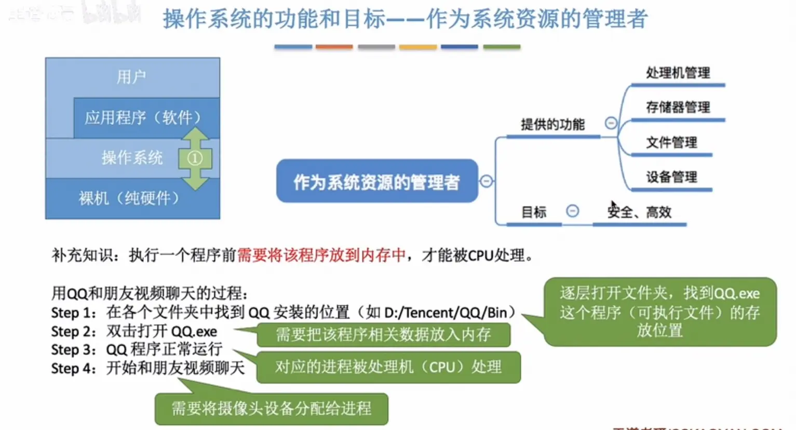
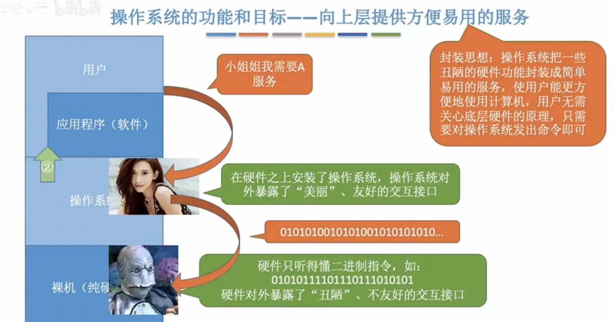
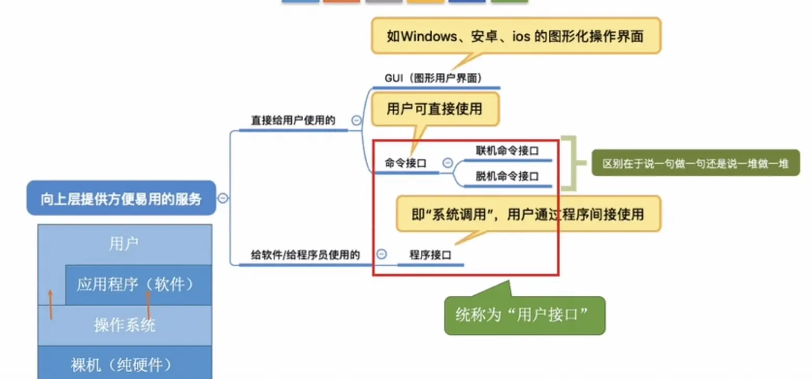
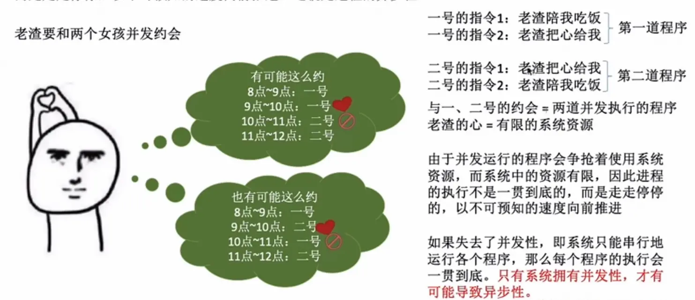
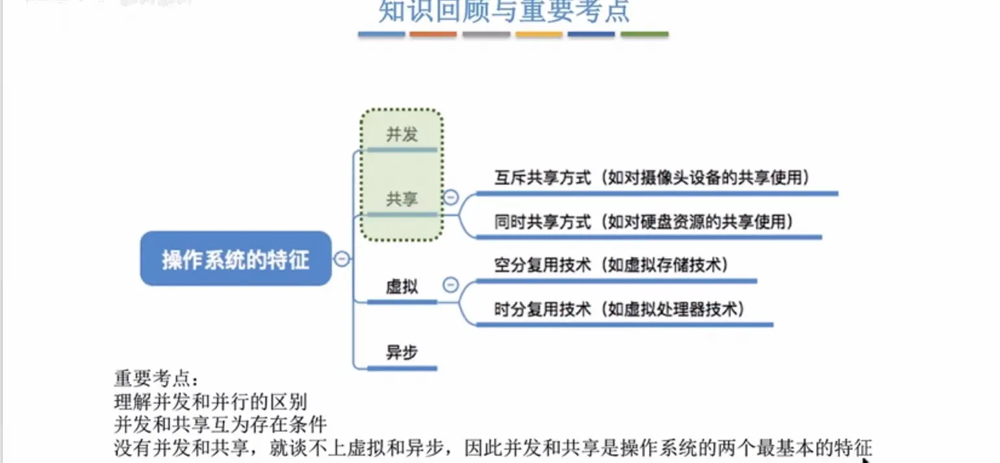
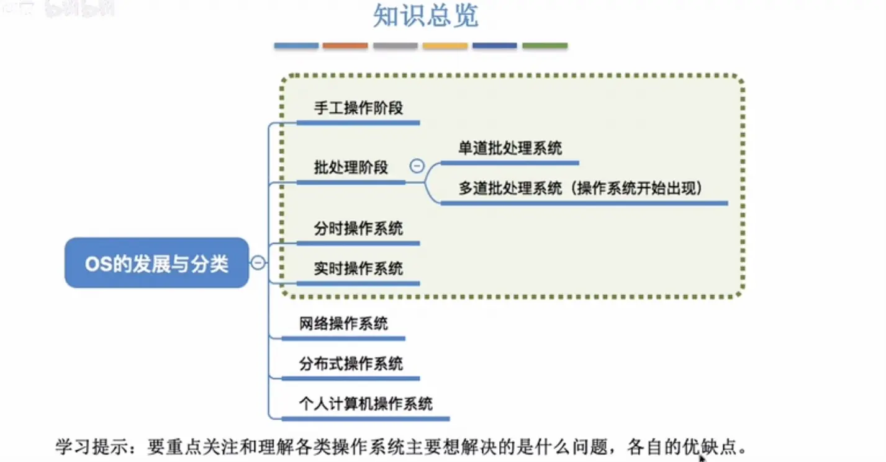
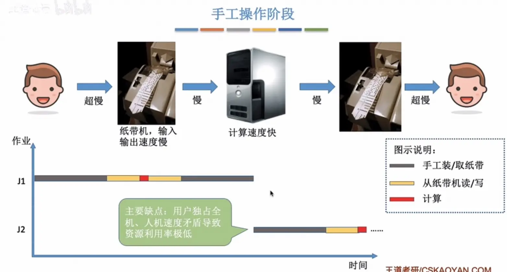
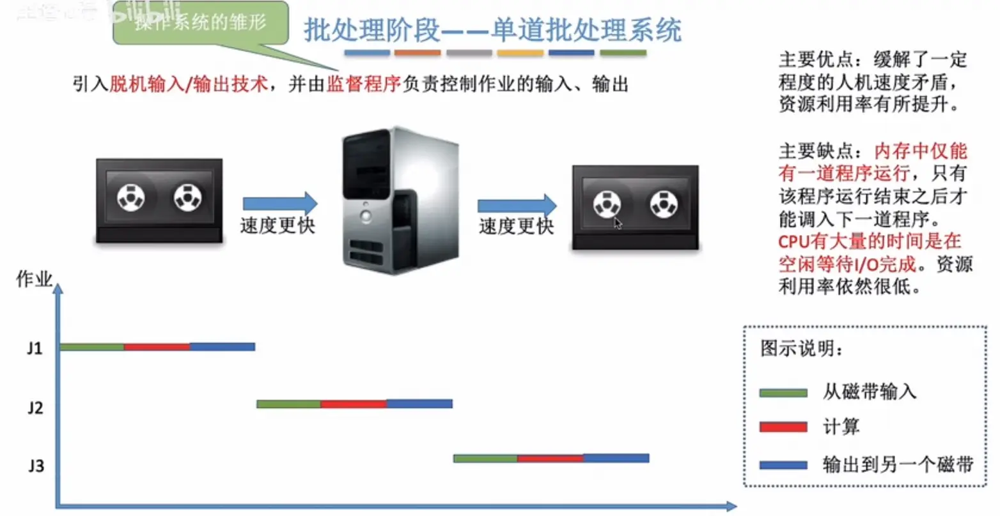

#  一 绪论

> author: spongehah from:hut
>
> 作者个人博客：https://blog.hahhome.top/
>
> 参考视频: B站王道考研计算机操作系统

[TOC]

# 1 操作系统的概念、功能

## 1.1 概念（定义）

**操作系统**(Operating System,Os)是指控制和**管理**整个计算机系统的**硬件和软件**资源，并合理地组织调度计算机的工作和资源的分配；以**提供给用户和其他软件方便的接口和环境**；它是计算机系统中最基本的**系统软件。**

## 1.2 三个功能和目标

>1. 操作系统是系统资源的管理者
>2. 向上层提供方便易用的服务
>3. 是最接近硬件的一层软件

### 功能1：系统资源的管理者

一共有四个功能：

- 处理机管理		Step3
- 存储器管理		Step2
- 文件管理		  Step1
- 设备管理		  Step4

### 功能2：向上层提供方便易用的服务

操作系统屏蔽掉了硬件的不友好的接口，而对用户暴露友好的交互接口

**程序接口**：可以在程序中进行**系统调用**来使用程序接口。普通用户不能直接使用程序接口，只能通过程序代码**间接**使用。

- 如：写C语言“Hello world”程序时，在printf函数的底层就使用到了操作系统提供的显式相关的“系统调用”
- 系统调用类似于函数调用，是应用程序请求操作系统服务的唯一方式
- 在有的教材中：**系统调用=广义指令**

#### 附录：接口的分类

> **接口的分类：**
>
> 
>
> - 给用户使用的
>
>   1. GUI图形化接口
>
>   2. 命令接口：
>
>      - 联机命令接口
>        - 交互式接口	**一句一句**的执行
>
>      - 脱机命令接口
>        - **批量**处理	类似于交互式接口的集合，如windows的.bat文件
>
> - 给软件/程序员使用的
>
>   1. 程序接口，即**系统调用**，用户通过程序间接调用（2.3中详细讲解）

### 功能3：作为最接近硬件的层次

需要实现**对硬件机器的拓展**

没有任何软件支持的计算机成为**裸机**。在裸机上安装的操作系统，可以提供资源管理功能和方便用户的服务功能，将裸机改造成功能更强、使用更方便的机器

通常把覆盖了软件的机器成为**扩充机器**，又称之为**虚拟机**

>类比汽车：
>
>发动机一一只会转：轮胎一一只会滚：
>在原始的硬件机器上覆盖一层传动系统一一让发动机带着轮子转一一使原始的硬件机器得到拓展
>
>操作系统对硬件机器的拓展：将CPU、内存、磁盘、显示器、键盘等硬件合理地组织起来，让各种硬件
>能够相互协调配合，实现更多更复杂的功能

## 1.3 小总结

# 2 操作系统的特征

## 2.1 操作系统最基本的两个特征--并发和共享

1. **并发**：指两个或多个事件在同一时间间隔内发生。这些事件**宏观上是同时发生**的，但**微观上是交替发生**的。
   - 常考易混概念一一**并行**：指两个或多个事件在同一时刻同时发生。
   - **操作系统的并发性**指计算机系统中“同时”运行着多个程序，这些程序宏观上看是同时运行着的，而微观上看是交替运行的。
   - 操作系统就是伴随着“多道程序技术”而出现的。因此，**操作系统和程序并发是一起诞生的**。
   - **注意：** **单核CPU**同一时刻只能执行**一个程序**，各个程序只能**并发**地执行；**多核CPU**同一时刻可以同时执行**多个程序**，多个程序可以**并行**地执行；
     比如Intel的第八代i3处理器就是4核CPU,意味着可以并行地执行4个程序
2. **共享**：共享即资源共享，是指系统中的资源可供内存中多个并发执行的进程共同使用。
   - 有两种资源共享方式：
     1. `互斥共享方式`：系统中的某些资源，虽然可以提供给多个进程使用，但**一个时间段内只允许`一个进程`访问该资源**
     2. `同时共享方式`：系统中的某些资源，**允许一个时间段内由`多个进程`“同时”对它们进行访问**

> 所谓的“同时”往往是宏观上的，而在微观上，这些进程可能是交替地对该资源进行访问的（即分时共享）
>
> 生活实例：
> 互斥共享方式：
> 使用QQ和微信视频。同一时间段内摄像头只能分配给其中一个进程。
> 同时共享方式：使用QQ发送文件A,同时使用微信发送文件B。宏观上看，两边都在同时读取并发送文件，说明两个进程都在访问硬盘资源，从中读取数据。微观上看，两个进程是交替着访问硬盘的。

### 并发和共享的关系

- **并发性**指计算机系统中同时存在着多个运行着的程序。
- **共享性**是指系统中的资源可供内存中多个并发执行的进程共同使用。

通过上述例子来看并发与共享的关系：

使用QQ发送文件A,同时使用微信发送文件B。

1.两个进程正在并发执行**（并发性）**

2.需要共享地访问硬盘资源**（共享性）**

>可以看到：
>
>如果失去并发性，则系统中只有一个程序正在运行，则共享性失去存在的意义
>
>如果失去共享性，则QQ和微信不能同时访问硬盘资源，就无法实现同时发送文件，也就无法并发

**所以`并发性和共享性互为存在条件`**

## 2.2 另外两个特征

### 1）虚拟

**虚拟**是指把一个物理上的实体变为若干个逻辑上的对应物。物理实体（前者）是实际存在的，而逻辑上对应物（后者）是用户感受到的。

虚拟技术包含：

- 空分复用技术（如虚拟存储器技术）
- 时分复用技术（如虚拟处理器）

先说结论：显然，如果失去了并发性，则一个时间段内系统中只需运行一道程序，那么就失去了实现虚拟性的意义了。因此，**没有并发性，就谈不上虚拟性**

>Yo~用两个个例子来理解
>背景知识：一个程序**需要放入内存**并给它**分配CPU**才能执行
>
>
>
>**虚拟技术中的“空分复用技术”：**
>
>eg1：GTA5需要4GB的运行内存，QQ需要256MB的内存，迅雷需要256MB的内存，网易云音乐需要256MB的内存
>我的电脑：4GB内存
>问题：这些程序同时运行需要的内存远大于4GB,那么为什么它们还可以在我的电脑上同时运行呢？
>答：这是虚拟存储器技术。实际只有4GB的内存，在用户看来似乎远远大于4GB
>
>
>
>**虚拟技术中的“时分复用技术”**。微观上处理机在各个微小的时间段内交替着为各个进程服务
>
>eg2：单核CPU打开六个应用程序，但6个程序却能同时运行

### 2）异步

**异步**是指，在多道程序环境下，允许多个程序并发执行，但由于资源有限，进程的执行不是一贯到底的，而是走走停停，以不可预知的速度向前推进，这就是进程的异步性。

> eg:
>
> 

由于并发运行的程序会争抢着使用系统资源，而系统中的资源有限，因此进程的执行不是一贯到底的，而是走走停停的，以不可预知的速度向前推进

如果失去了并发性，即系统只能串行地运行各个程序，那么每个程序的执行会一贯到底。**只有系统拥有并发性，才有可能导致异步性**

没有并发和共享，就谈不上虚拟和异步，而并发和共享互为存在条件，**因此并发和共享是操作系统的两个最基本的特征**

## 2.3 小总结

# 3 OS的发展与分类

## 3.1 手工操作阶段

> **CPU和人工串行**，CPU总是等待人的操作，CPU利用率极低

## 3.2 单道批处理系统（引入脱机I/O）

> **监督程序**实现批处理，程序可以一批一批进行处理，减少了人机矛盾，略微提高了CPU的利用率
>
> 缺点：但是CPU的处理速度仍然远高于I/O速度，CPU与I/O设备串行，告诉CPU受到低俗IO牵制

## 3.3 多道批处理系统（操作系统的开始）

>优点：CPU和IO错开执行，可让多道程序并发执行，资源利用率大幅提升
>
>缺点：没有人机交互功能

## 3.4 分时操作系统

> 优点：提供人机交互功能
>
> 缺点：不能优先处理紧急任务

## 3.5 实时操作系统

> 分类：
>
> - 硬实时
> - 软实时
>
> 优点：提供人机交互功能，且能优先处理紧急任务

还有其它不常用的操作系统，小总结中可见

## 3.6 小总结

