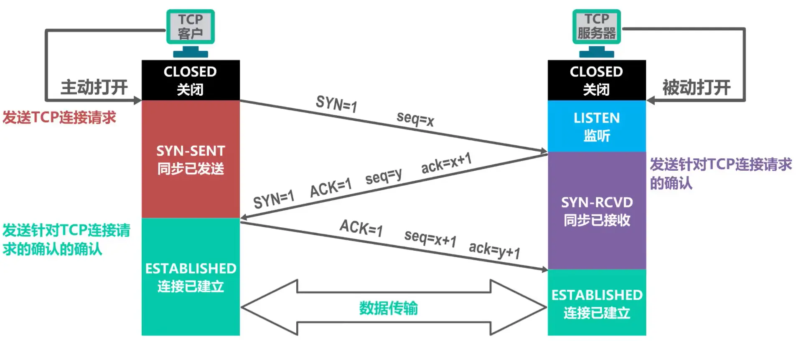
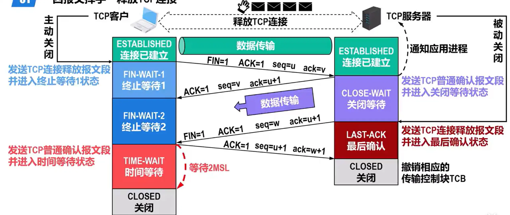

## start

> 本篇文章主要参考自JavaGuide、小林Coding

[TOC]

## 1 OSI七层(TCP/IP)体系机构


1. **应用层位于传输层之上，主要提供两个终端设备上的应用程序之间信息交换的服务，它定义了信息交换的格式，消息会交给下一层传输层来传输。** 我们把应用层交互的数据单元称为报文。

2. **传输层的主要任务就是负责向两台终端设备进程之间的通信提供通用的数据传输服务**

3. **网络层负责为分组交换网上的不同主机提供通信服务。**

4. **数据链路层的作用是将网络层交下来的 IP 数据报组装成帧，在两个相邻节点间的链路上传送帧。每一帧包括数据和必要的控制信息（如同步信息，地址信息，差错控制等）。**

   **物理层的作用是实现相邻计算机节点之间比特流的透明传送，尽可能屏蔽掉具体传输介质和物理设备的差异**


## 2 HTTP vs HTTPS

- **端口号**：HTTP 默认是 80，HTTPS 默认是 443。
- **URL 前缀**：HTTP 的 URL 前缀是 `http://`，HTTPS 的 URL 前缀是 `https://`。
- **安全性和资源消耗**：HTTP 协议运行在 TCP 之上，所有传输的内容都是明文，客户端和服务器端都无法验证对方的身份。HTTPS 是运行在 SSL/TLS 之上的 HTTP 协议，SSL/TLS 运行在 TCP 之上。所有传输的内容都经过加密，加密采用对称加密，但对称加密的密钥用服务器方的证书进行了非对称加密。所以说，HTTP 安全性没有 HTTPS 高，但是 HTTPS 比 HTTP 耗费更多服务器资源。
- **SEO（搜索引擎优化）**：搜索引擎通常会更青睐使用 HTTPS 协议的网站，因为 HTTPS 能够提供更高的安全性和用户隐私保护。使用 HTTPS 协议的网站在搜索结果中可能会被优先显示，从而对 SEO 产生影响。

## 3 HTTP/1.0 vs HTTP/1.1

- **连接方式** : HTTP/1.0 为短连接，**HTTP/1.1 支持长连接。**
- **带宽**：HTTP/1.0 中，存在一些浪费带宽的现象，例如客户端只是需要某个对象的一部分，而服务器却将整个对象送过来了，并且不`支持断点续传功能`，HTTP/1.1 则在请求头引入了 range 头域，它允许只请求资源的某个部分，即返回码是 206（Partial Content），这样就方便了开发者自由的选择以便于充分利用带宽和连接。
- **管道传输：**HTTP1.1**支持管道传输**，只要一个请求发出去，不需要等其回来，就可以发送第二个请求，减少整体的响应时间


- **Host 头（Host Header）处理** :HTTP/1.1 引入了 Host 头字段，允许在同一 IP 地址上托管多个域名，从而支持虚拟主机的功能。而 HTTP/1.0 没有 Host 头字段，无法实现虚拟主机。
- **状态响应码** : HTTP/1.1 中新加入了大量的状态码，光是错误响应状态码就新增了 24 种。
- **缓存机制** : 在 HTTP/1.0 中主要使用 Header 里的 If-Modified-Since,Expires 来做为缓存判断的标准，HTTP/1.1 则引入了更多的缓存控制策略例如 Entity tag，If-Unmodified-Since, If-Match, If-None-Match 等更多可供选择的缓存头来控制缓存策略。

## 4 HTTP/1.1 vs HTTP/2.0

- **多路复用（Multiplexing）**：HTTP/2.0 的多路复用使得不同的请求可以共用一个 TCP 连接，避免建立多个连接带来不必要的额外开销，而 HTTP/1.1 中的每个请求都会建立一个单独的连接
  而浏览器为了控制资源会有 6-8 个 TCP 连接都限制。这使得 HTTP/2.0 在处理多个请求时更加高效，减少了网络延迟和提高了性能。
- **二进制帧（Binary Frames）**：HTTP/2.0 使用二进制帧进行数据传输，而 HTTP/1.1 则使用文本格式的报文。二进制帧更加紧凑和高效，减少了传输的数据量和带宽消耗。
- **头部压缩（Header Compression）**：HTTP/1.1 支持`Body`压缩，`Header`不支持压缩。HTTP/2.0 支持对`Header`压缩，使用了专门为`Header`压缩而设计的 `HPACK 算法`，在服务端和客户端建立头信息表，减少了网络开销。
- **服务器推送（Server Push）**：HTTP/2.0 支持服务器推送，可以在客户端请求一个资源时，将其他相关资源一并推送给客户端，从而减少了客户端的请求次数和延迟。而 HTTP/1.1 需要客户端自己发送请求来获取相关资源。

## 5 HTTP/2.0 vs HTTP/3.0

- **传输协议**：HTTP/2.0 是基于 TCP 协议实现的，`HTTP/3.0 改用 QUIC`（Quick UDP Internet Connections） 协议来实现可靠的传输。
- **连接建立**：HTTP/2.0 建立安全连接https 需要 2.5 或 3.5 个 RTT）。HTTP/3.0 `连接建立仅需 0-RTT 或者 1-RTT`。这意味着 QUIC 在最佳情况下不需要任何的额外往返时间就可以建立新连接。
  - TCP 三次握手：客户端和服务器交换 SYN 和 ACK 包，建立一个 TCP 连接。这个过程需要 1.5 个 RTT（round-trip time），即一个数据包从发送到接收的时间。
  - TLS 握手：客户端和服务器交换密钥和证书，建立一个 TLS 加密层。这个过程需要至少 1 个 RTT（TLS 1.3）或者 2 个 RTT（TLS 1.2）。
  - HTTP/3.0中QUIC 协议（TLS 1.3，TLS 1.3 除了支持 1 个 RTT 的握手，还支持 0 个 RTT 的握手）
- **队头阻塞**：HTTP/2.0 多请求复用一个 TCP 连接，一旦发生丢包，就会阻塞住所有的 HTTP 请求。由于 QUIC 协议的特性，HTTP/3.0 在`一定程度上解决了队头阻塞`（Head-of-Line blocking, 简写：HOL blocking）问题`，一个连接建立多个不同的数据流`，这些数据流之间独立互不影响，某个数据流发生丢包了，其数据流不受影响（本质上是多路复用+轮询）。
- **错误恢复**：HTTP/3.0 具有更好的错误恢复机制，当出现丢包、延迟等网络问题时，可以更快地进行恢复和重传。而 HTTP/2.0 则需要依赖于 TCP 的错误恢复机制。


## 6 WebSocket

WebSocket 是一**种基于 TCP** 连接的全双工通信协议，即客户端和服务器可以同时发送和接收数据。

### 6.1 WebSocket 和 HTTP 有什么区别？

WebSocket 和 HTTP 两者都是基于 TCP 的应用层协议，都可以在网络中传输数据。

下面是二者的主要区别：

- WebSocket 是一种`双向实时通信协议`，而 HTTP 是一种单向通信协议。并且，HTTP 协议下的通信只能由客户端发起，服务器无法主动通知客户端。
- WebSocket 使用 ws:// 或 wss://（使用 SSL/TLS 加密后的协议，类似于 HTTP 和 HTTPS 的关系） 作为协议前缀，HTTP 使用 http:// 或 https:// 作为协议前缀。
- WebSocket 可以`支持扩展`，用户可以扩展协议，实现部分自定义的子协议，如支持压缩、加密等。
- WebSocket 通信`数据格式比较轻量`，用于协议控制的数据包头部相对较小，网络开销小，而 HTTP 通信每次都要携带完整的头部，网络开销较大（HTTP/2.0 使用二进制帧进行数据传输，还支持头部压缩，减少了网络开销）。

### 6.2 WebSocket 的工作过程是什么样的？

WebSocket 的工作过程可以分为以下几个步骤：

1. 想建立 WebSocket 连接，就会在 HTTP 请求里带上一些**特殊的header 头**，如下：

   ```http
   Connection: Upgrade
   Upgrade: WebSocket
   Sec-WebSocket-Key: T2a6wZlAwhgQNqruZ2YUyg==\r\n
   ```

2. 如果服务器正好支持升级成 WebSocket 协议。就会走 WebSocket 握手流程，同时根据客户端生成的 base64 码，用某个**公开的**算法变成另一段字符串，放在 HTTP 响应的 `Sec-WebSocket-Accept` 头里，同时带上`101状态码`，发回给浏览器。HTTP 的响应如下：

   ```http
   HTTP/1.1 101 Switching Protocols\r\n
   Sec-WebSocket-Accept: iBJKv/ALIW2DobfoA4dmr3JHBCY=\r\n
   Upgrade: WebSocket\r\n
   Connection: Upgrade\r\n
   ```

3. 客户端和服务器之间建立了一个 WebSocket 连接，可以进行双向的数据传输。数据以帧（frames）的形式进行传送，WebSocket 的每条消息可能会被切分成多个数据帧（最小单位）。发送端会将消息切割成多个帧发送给接收端，接收端接收消息帧，并将关联的帧重新组装成完整的消息。


4. 客户端或服务器可以主动发送一个关闭帧，表示要断开连接。另一方收到后，也会回复一个关闭帧，然后双方关闭 TCP 连接。

另外，建立 WebSocket 连接之后，通过心跳机制来保持 WebSocket 连接的稳定性和活跃性。

### 6.3 WebSocket的消息格式

数据包在WebSocket中被叫做**帧**


- **opcode字段**：这个是用来标志这是个**什么类型**的数据帧。比如：
  - 等于 1 ，是指text类型（`string`）的数据包
  - 等于 2 ，是二进制数据类型（`[]byte`）的数据包
  - 等于 8 ，是关闭连接的信号
- **payload字段**：存放的是我们**真正想要传输的数据的长度**，单位是**字节**。比如你要发送的数据是`字符串"111"`，那它的长度就是`3`。
  - 有多个payload字段，从前往后读取，若第一个payload表示的长度不够，就读下一个更长的payload，以此类推

### 6.3 WebSocket 与 SSE 有什么区别？

SSE 与 WebSocket 作用相似，都可以建立服务端与浏览器之间的通信，实现服务端向客户端推送消息，但还是有些许不同：

- **SSE 是基于 HTTP 协议的**，它们不需要特殊的协议或服务器实现即可工作；WebSocket 需单独服务器来处理协议。
- **SSE 单向通信**，只能由服务端向客户端单向通信；WebSocket 全双工通信，即通信的双方可以同时发送和接受信息。
- SSE 实现简单开发成本低，无需引入其他组件；WebSocket 传输数据需做二次解析，开发门槛高一些。
- SSE 默认支持断线重连；WebSocket 则需要自己实现。
- SSE 只能传送文本消息，二进制数据需要经过编码后传送；WebSocket 默认支持传送二进制数据和文本数据。

**SSE 与 WebSocket 该如何选择？**

- WebSocket：双向、全双工通信。对于游戏、即时通信以及需要双向近乎实时更新的场景。
- SSE：`不需要从客户端发送数据`。而你只需要一些服务器操作的更新。比如：站内信、未读消息数、状态更新、股票行情、监控数量等场景，SEE 不管是从实现的难易和成本上都更加有优势。此外，SSE 具有 WebSocket 在设计上缺乏的多种功能，例如：自动重新连接、事件 ID 和发送任意事件的能力。

## 7 TCP 与 UDP 的区别

1. **是否面向连接**：UDP 在传送数据之前不需要先建立连接。而 TCP 提供面向连接的服务，在传送数据之前必须先建立连接，数据传送结束后要释放连接。
2. **是否是可靠传输**：远地主机在收到 UDP 报文后，不需要给出任何确认，并且不保证数据不丢失，不保证是否顺序到达。TCP 提供可靠的传输服务，TCP 在传递数据之前，会有三次握手来建立连接，而且在数据传递时，有确认、窗口、重传、拥塞控制机制。通过 TCP 连接传输的数据，无差错、不丢失、不重复、并且按序到达。
3. **是否有状态**：这个和上面的“是否可靠传输”相对应。TCP 传输是有状态的，这个有状态说的是 TCP 会去记录自己发送消息的状态比如消息是否发送了、是否被接收了等等。为此 ，TCP 需要维持复杂的连接状态表。而 UDP 是无状态服务，简单来说就是不管发出去之后的事情了（**这很渣男！**）。
4. **传输效率**：由于使用 TCP 进行传输的时候多了连接、确认、重传等机制，所以 TCP 的传输效率要比 UDP 低很多。
5. **传输形式**：TCP 是面向字节流的，UDP 是面向报文的。
6. **首部开销**：TCP 首部开销（20 ～ 60 字节）比 UDP 首部开销（8 字节）要大。
7. **是否提供广播或多播服务**：TCP 只支持点对点通信，UDP 支持一对一、一对多、多对一、多对多；

|                        | TCP            | UDP        |
| ---------------------- | -------------- | ---------- |
| 是否面向连接           | 是             | 否         |
| 是否可靠               | 是             | 否         |
| 是否有状态             | 是             | 否         |
| 传输效率               | 较慢           | 较快       |
| 传输形式               | 字节流         | 数据报文段 |
| 首部开销               | 20 ～ 60 bytes | 8 bytes    |
| 是否提供广播或多播服务 | 否             | 是         |

**UDP 一般用于即时通信**，比如：语音、 视频、直播等等。这些场景对传输数据的准确性要求不是特别高，比如你看视频即使少个一两帧，实际给人的感觉区别也不大。

**TCP 用于对传输准确性要求特别高的场景**，比如文件传输、发送和接收邮件、远程登录等等。

## 8 TCP 延迟确认机制

当发送没有携带数据的 ACK，它的网络效率也是很低的，因为它也有 40 个字节的 IP 头 和 TCP 头，但却没有携带数据报文。 为了解决 ACK 传输效率低问题，所以就衍生出了 **TCP 延迟确认**。 TCP 延迟确认的策略：

- 当有响应数据要发送时，ACK 会随着响应数据一起立刻发送给对方
- 当没有响应数据要发送时，ACK 将会延迟一段时间，以等待是否有响应数据可以一起发送，达到最大延迟确认时间后 进行ACK发送
- 如果在延迟等待发送 ACK 期间，对方的第二个数据报文又到达了，这时就会立刻发送 ACK

## 9 TCP连接的建立与断开

### 9.1 三报文握手



> 为什么不能使用两报文握手？
>
> - 为了告诉客户端：“我接收到的信息确实就是你所发送的信号了”，这表明从客户端到服务端的通信是正常的。
> - 为了**防止已失效的连接请求**报文段突然又传送到了TCP服务器，因而导致错误

### 9.2 四报文挥手



> 为什么要进入TIME-WAIT状态？
>
> - 因为时间等待状态以及处于该状态2MSL时长，可以**确保TCP服务器进程可以收到最后一个TCP确认报文段而进入关闭状态**
> - 另外，TCP客户进程在发送完最后一个TCP确认报文段后，在经过2MSL时长，就可以**使本次连接持续时间内所产生的所有报文段都从网络中消失**，这样就可以使下一个新的TCP连接中，**不会出现旧连接中的报文段**

### 9.3 粗暴关闭 vs 优雅关闭

关闭的连接的函数有两种函数：

- `close 函数(粗暴关闭)`
  - socket **同时关闭发送方向和读取方向**，也就是 socket 不再有发送和接收数据的能力。如果有多进程/多线程共享同一个 socket，如果有一个进程调用了 close 关闭只是让 socket **引用计数 -1**，并不会导致 socket 不可用，同时也不会发出 FIN 报文，其他进程还是可以正常读写该 socket，直到**引用计数变为 0，才会发出 FIN 报文**。
  - 适用于服务端
- `shutdown 函数(优雅关闭)`
  - socket **可以指定只关闭读方向或写方向**，也就是 socket 不再有发送(接收)数据的能力，但是还是具有接收(发送)数据的能力。如果有多进程/多线程共享同一个 socket，shutdown 则不管引用计数，直接使得该 socket 不可用，然后发出 FIN 报文，如果有别的进程企图使用该 socket，将会受到影响。
  - 适用于客户端的FIN-WAIT-1，关闭写方向（所以发送FIN），保留读方向

### 9.4 保活计时器

- TCP服务器进程每收到一次TCP客户进程的数据，就重新设置并启动**保活计时器**(2小时定时)
- 若保活计时器定时周期内未收到TCP客户进程发来的数据，则**当保活计时器到时后，TCP服务器进程就向TCP客户进程发送一个探测报文段**，以后则**每隔75秒**钟发送一次。若**一连发送10个**探测报文段后仍无TCP客户进程的响应，TCP服务器进程就认为TCP客户进程所在主机出了故障，接着就关闭这个连接。

### 9.5 四报文挥手有可能合并第二和第三次挥手吗？

> 即客户端发送FIN（第一次）后，服务端回应ACK+FIN（第二次），最后客户端发送ACK（第三次）

可能的，需要满足两个条件：

1. 服务端没有数据要发送了
2. 开启了TCP延迟确认机制

当服务端接收到FIN后，需要回复一个ACK，但是因为TCP延迟确认机制，**自动等待有数据要发送时一起回传**，但是服务端没有数据要发送了，所以服务端发送FIN，FIN也是数据，所以**前面等待的ACK就和FIN一起回传了**，就形成了三次挥手

### 9.6 服务端与客户端进行TCP连接的流程

服务端伪代码：

```c
int main()
{
    /*Step 1: 创建服务器端监听socket描述符listen_fd*/    
    listen_fd = socket(AF_INET, SOCK_STREAM, 0);

    /*Step 2: bind绑定服务器端的IP和端口，所有客户端都向这个IP和端口发送和请求数据*/    
    bind(listen_fd, xxx);

    /*Step 3: 服务端开启监听*/    
    listen(listen_fd, 128);

    /*Step 4: 服务器等待客户端的链接，返回值cfd为客户端的socket描述符*/    
    cfd = accept(listen_fd, xxx);

    /*Step 5: 读取客户端发来的数据*/
    n = read(cfd, buf, sizeof(buf));
}
```

客户端伪代码：

```c
int main()
{
    /*Step 1: 创建客户端端socket描述符cfd*/    
    cfd = socket(AF_INET, SOCK_STREAM, 0);

    /*Step 2: connect方法,对服务器端的IP和端口号发起连接*/    
    ret = connect(cfd, xxxx);

    /*Step 4: 向服务器端写数据*/
    write(cfd, buf, strlen(buf));
}
```

> 服务端进行listen后，客户端发起connet进行连接，然后就会进行**三报文握手**

### 9.7 半连接队列与全连接队列


- **半连接队列（SYN队列）**，服务端收到**第一次握手**后，会将`sock`加入到这个队列中，队列内的`sock`都处于`SYN_RECV` 状态。
- **全连接队列（ACCEPT队列）**，在服务端收到**第三次握手**后，会将半连接队列的`sock`取出，放到全连接队列中。队列里的`sock`都处于 `ESTABLISHED`状态。这里面的连接，就**等着服务端执行accept()后被取出了。**

> 其中全连接队列（icsk_accept_queue）是个**链表**，而半连接队列（syn_table）是个**哈希表**。
>
> 为什么？
>
> - 全连接队列存放的是已经建立**完成的连接**，这些连接正等待被取走。服务端取走连接的过程中，并不关心具体是哪个连接，直接从队列头取就行了。这个过程算法复杂度为`O(1)`。
> - 半连接队列存放的都是**不完整的连接**，等待着第三次握手的到来。第三次握手来了，需要从队列里把相应IP端口的连接取出，使用哈希表能快速定位到取出的位置，算法复杂度就是`O(1)`，否则使用链表复杂度就是O(n)。

### 9.7 SYN 报文什么时候情况下会被丢弃？

1. 开启 **tcp_tw_recycle** 参数，并且在 **NAT** 环境下，造成 SYN 报文被丢弃（此参数已被废弃，慎用，建议关闭）
2. **TCP 两个连接队列满了**（半连接队列和全连接队列），造成 SYN 报文被丢弃

### 9.8 服务端没有listen或没有accept能建立连接吗？

- 没有listen
  - 没有listen不能建立连接，因为listen过后才开始三报文握手，服务端没有listen时收到客户端的SYN请求会**回传一个RST 报文**
- 没有accep
  - 建立连接的过程中根本不需要`accept()`参与， **执行accept()只是为了从全连接队列里取出一条连接。**

## 10 TCP可靠传输的保障

1. **基于数据块传输**：应用数据被分割成 TCP 认为最适合发送的数据块
2. **对失序数据包重新排序以及去重**：使用seq序列号进行去重和排序
3. **校验和(差错检测)**：如果收到段的检验和有差错，TCP 将丢弃这个报文段和不确认收到此报文段
4. **重传机制(自动请求重传协议ARQ)**：数据包丢失或延迟的情况下，重新发送数据包，直到收到对方的确认应答
5. **流量控制**：TCP 使用的流量控制协议是可变大小的滑动窗口协议（TCP 利用滑动窗口实现流量控制）。
6. **拥塞控制**：TCP 在发送数据的时候，需要考虑两个因素：一是接收方的接收能力，二是网络的拥塞程度。四个算法：慢开始、拥塞避免、快重传、快恢复

超时重传时间的选择：


## 11 如何理解TCP是面向字节流，而UDP是面向报文的？

- 当用户消息通过 UDP 协议传输时，**操作系统不会对消息进行拆分**，在组装好 UDP 头部后就交给网络层来处理，所以发出去的 UDP 报文中的数据部分就是完整的用户消息，也就是**每个 UDP 报文就是一个用户消息的边界**，这样接收方在接收到 UDP 报文后，读一个 UDP 报文就能读取到完整的用户消息。（区分多个UDP报文：插入到队列里）
- 当用户消息通过 TCP 协议传输时，**消息可能会被操作系统分组成多个的 TCP 报文**，也就是一个完整的用户消息被拆分成多个 TCP 报文进行传输。**我们不能认为一个用户消息对应一个 TCP 报文，正因为这样，所以 TCP 是面向字节流的协议**。接收方的程序如果不知道发送方发送的消息的长度，也就是不知道消息的边界时，是无法读出一个有效的用户消息的。

> 粘包与拆包的产生：
>
> - 当两个消息的某个部分内容被分到同一个 TCP 报文时，就是我们常说的 TCP **粘包**问题，这时接收方不知道消息的边界的话，是无法读出有效的消息。
> - 对应的，当一条消息的某个部分被分到了其它的TCP报文时，就是我们常说的 TCP **拆包**问题
>
> 在Netty中的体现：
>
> 1. 应用程序写入的数据**大于套接字缓冲区大小**，这将会发生**拆包**。
> 2. 进行MSS（最大报文长度）大小的TCP分段，当TCP报文长度-TCP头部长度**>MSS**的时候将发生**拆包**。
> 3. 应用程序写入数据**小于套接字缓冲区大小**，网卡将应用多次写入的数据发送到网络上，这将会发生**粘包**。
> 4. 接收方法**不及时读取套接字缓冲区数据，**这将发生**粘包**。

## 12 粘包与拆包的解决方式

粘包与拆包 的问题出现是**因为不知道一个用户消息的边界**在哪，如果知道了边界在哪，接收方就可以通过边界来划分出有效的用户消息。

一般有三种方式分包的方式：

1. 固定长度的消息；
2. 特殊字符作为边界；
   - 例如：HTTP 通过设置 回车符/换行符 作为 HTTP 报文协议 header与body的边界。
3. 自定义消息结构：
   - 发送端给每个数据包添加包首部，首部中应该至少包含数据包的长度，这样接收端在接收到数据后，通过读取包首部的长度字段，便知道每一个数据包的实际长度了。

## 13 地址解析协议ARP

当主机发送 IP 数据报文时（网络层），仅知道目的地的 IP 地址，并不清楚目的地的 MAC 地址，我们使用ARP协议来根据IP地址获取设备的MAC地址

**ARP 工作原理：ARP 表、广播问询、单播响应**

1. ARP 表记录了某些其他网络设备的 IP 地址-MAC 地址映射关系，该映射关系以 `<IP, MAC, TTL>` 三元组的形式存储。其中，TTL 为该映射关系的生存周期，典型值为 20 分钟，超过该时间，该条目将被丢弃。
2. 同一局域网内的 MAC 寻址：
   - 源主机发送ARP广播请求，目的MAC地址为FF-FF-FF-FF-FF-FF，**目的主机**接收到发给自己IP的请求后，将源主机的IP和MAC映射添加到自己的ARP表，然后单播发回ARP响应分组
3. 不同局域网内的 MAC 寻址：
   - 源主机发送ARP广播请求，目的MAC地址为FF-FF-FF-FF-FF-FF，**目标路由器**接收到可以转发到对应子网的请求后，将**路由器目的接口**的IP和MAC映射添加到自己的ARP表，然后单播发回ARP响应分组

## 14 IPv6 vs IPv4

- **更大的地址空间**
- **无状态地址自动配置（Stateless Address Autoconfiguration，简称 SLAAC）**：主机可以直接通过根据接口标识和网络前缀生成全局唯一的 IPv6 地址，而无需依赖 DHCP（Dynamic Host Configuration Protocol）服务器，简化了网络配置和管理。
- **NAT（Network Address Translation，网络地址转换） 成为可选项**：IPv6 地址资源充足，可以给全球每个设备一个独立的地址。
- **对标头结构进行了改进**：IPv6 标头结构相较于 IPv4 更加简化和高效，减少了处理开销，提高了网络性能。
- **可选的扩展头**：允许在 IPv6 标头中添加不同的扩展头（Extension Headers），用于实现不同类型的功能和选项。
- **ICMPv6（Internet Control Message Protocol for IPv6）**：IPv6 中的 ICMPv6 相较于 IPv4 中的 ICMP 有了一些改进，如邻居发现、路径 MTU 发现等功能的改进，从而提升了网络的可靠性和性能。


## end
